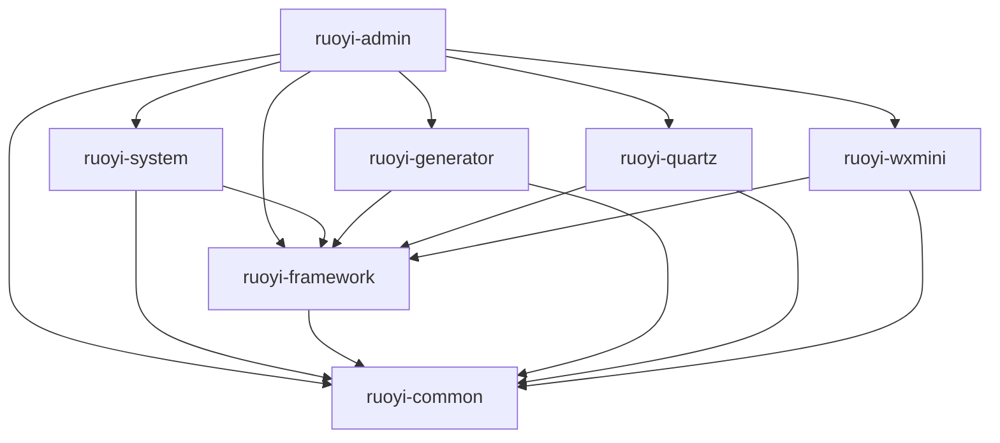

# 若依框架模块技术文档总览

## 文档说明

本文档目录包含了若依框架各个模块的详细技术文档，包括实体类说明、数据库表结构、配置说明、使用示例等内容。

## 模块列表

### 1. ruoyi-admin 模块
- **文档位置**: [ruoyi-admin模块技术文档.md](./ruoyi-admin模块技术文档.md)
- **模块描述**: 启动模块，包含Spring Boot启动类和全局配置
- **主要功能**: 应用启动、全局配置、异常处理

### 2. ruoyi-common 模块
- **文档位置**: [ruoyi-common模块技术文档.md](./ruoyi-common模块技术文档.md)
- **模块描述**: 公共模块，提供核心基础类和通用功能
- **主要功能**: 基础实体类、工具类、常量、异常处理、数据权限、操作日志

### 3. ruoyi-system 模块
- **文档位置**: [ruoyi-system模块技术文档.md](./ruoyi-system模块技术文档.md)
- **模块描述**: 系统管理模块，提供核心业务功能
- **主要功能**: 用户管理、角色管理、菜单管理、部门管理、岗位管理、字典管理、参数管理、通知公告、日志管理

### 4. ruoyi-framework 模块
- **文档位置**: [ruoyi-framework模块技术文档.md](./ruoyi-framework模块技术文档.md)
- **模块描述**: 框架核心模块，提供Spring Boot核心配置
- **主要功能**: 安全配置、数据源配置、Web配置、异常处理、权限管理、缓存管理

### 5. ruoyi-generator 模块
- **文档位置**: [ruoyi-generator模块技术文档.md](./ruoyi-generator模块技术文档.md)
- **模块描述**: 代码生成模块，提供基于数据库表的代码自动生成
- **主要功能**: 代码生成、模板管理、表结构导入、代码预览

### 6. ruoyi-quartz 模块
- **文档位置**: [ruoyi-quartz模块技术文档.md](./ruoyi-quartz模块技术文档.md)
- **模块描述**: 定时任务模块，基于Quartz框架实现
- **主要功能**: 定时任务管理、任务调度、任务日志、Cron表达式

### 7. ruoyi-wxmini 模块
- **文档位置**: [ruoyi-wxmini模块技术文档.md](./ruoyi-wxmini模块技术文档.md)
- **模块描述**: 微信小程序模块，提供微信小程序后端支持
- **主要功能**: 微信登录、微信支付、消息推送、用户管理

## 模块依赖关系

## 文档结构说明

每个模块的技术文档包含以下内容：

### 1. 模块概述
- 模块功能描述
- 主要特性说明
- 使用场景介绍

### 2. 实体类说明
- 实体类详细描述
- 字段说明表格
- 继承关系说明
- 注解说明

### 3. 数据库表结构
- 表结构SQL
- 字段说明
- 索引说明
- 外键关系

### 4. 控制器类
- API接口说明
- 请求参数
- 响应格式
- 使用示例

### 5. 服务类
- 服务接口说明
- 实现类说明
- 核心方法
- 业务逻辑

### 6. 配置类
- 配置项说明
- 配置示例
- 参数说明
- 注意事项

### 7. 工具类
- 工具方法说明
- 使用示例
- 参数说明
- 返回值说明

### 8. 使用示例
- 完整使用流程
- 代码示例
- 配置示例
- 注意事项

## 数据库表总览

### 系统管理表
- `sys_user` - 用户信息表
- `sys_role` - 角色信息表
- `sys_menu` - 菜单权限表
- `sys_dept` - 部门表
- `sys_post` - 岗位信息表
- `sys_user_role` - 用户和角色关联表
- `sys_user_post` - 用户和岗位关联表
- `sys_role_menu` - 角色和菜单关联表
- `sys_dict_type` - 字典类型表
- `sys_dict_data` - 字典数据表
- `sys_config` - 参数配置表
- `sys_notice` - 通知公告表
- `sys_oper_log` - 操作日志记录
- `sys_logininfor` - 系统访问记录
- `sys_job` - 定时任务调度表
- `sys_job_log` - 定时任务执行日志表

### 代码生成表
- `gen_table` - 代码生成业务表
- `gen_table_column` - 代码生成业务表字段

### 微信小程序表
- `wx_mini_user` - 微信小程序用户表
- `wx_pay_order` - 微信支付订单表

## 技术栈说明

### 后端技术
- **Spring Boot**: 2.5.x
- **Spring Security**: 5.5.x
- **MyBatis Plus**: 3.4.x
- **Druid**: 1.2.x
- **Quartz**: 2.3.x
- **JWT**: 0.11.x
- **Redis**: 5.x
- **MySQL**: 8.x

### 微信相关
- **微信小程序SDK**: 4.5.0
- **微信支付SDK**: 4.5.0

### 工具类库
- **Hutool**: 5.x
- **Apache Commons**: 3.x
- **Jackson**: 2.x
- **Lombok**: 1.18.x

## 开发规范

### 代码规范
- 遵循阿里巴巴Java开发规范
- 使用统一的代码格式化配置
- 必要的注释和文档说明
- 合理的命名规范

### 数据库规范
- 表名使用小写字母和下划线
- 字段名使用小写字母和下划线
- 必须有主键和创建时间字段
- 合理的索引设计

### API规范
- 统一的响应格式
- 合理的HTTP状态码
- 完整的参数验证
- 友好的错误信息

## 部署说明

### 环境要求
- **Java**: JDK 1.8+
- **MySQL**: 5.7+
- **Redis**: 5.0+
- **Nginx**: 1.18+

### 部署步骤
1. 数据库初始化
2. 配置文件修改
3. 项目打包
4. 环境部署
5. 服务启动

## 注意事项

### 安全注意
- 定期更换JWT密钥
- 数据库密码加密存储
- API接口权限控制
- 敏感信息脱敏

### 性能注意
- 合理使用缓存
- 数据库连接池配置
- 静态资源CDN加速
- 日志文件定期清理

### 运维注意
- 定期数据备份
- 系统监控告警
- 日志分析处理
- 性能优化调整

## 版本信息

- **框架版本**: 4.6.0
- **文档更新时间**: 2024-01-01
- **维护团队**: ruoyi开发团队

## 联系方式

- **项目地址**: https://gitee.com/y_project/RuoYi-Vue
- **文档反馈**: 请提交Issue或Pull Request
- **技术交流**: 加入官方QQ群或微信群

---

*本文档由若依框架开发团队维护，如有问题请及时反馈。*
