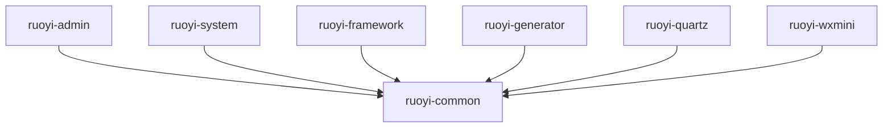

# ruoyi-common 模块技术文档

## 模块概述

ruoyi-common是若依框架的公共模块，提供了系统核心的基础类和通用功能。

## 实体类说明

### `com.ruoyi.common.core.domain.BaseEntity` -- 基础实体类

所有业务实体的基类，提供了通用的审计字段和搜索功能。

| 字段 | 类型 | 说明 |
|------|------|------|
| searchValue | String | 搜索值 |
| createBy | String | 创建者 |
| createTime | Date | 创建时间 |
| updateBy | String | 更新者 |
| updateTime | Date | 更新时间 |
| remark | String | 备注 |
| params | Map<String, Object> | 请求参数 |

**继承关系**：
- 实现 `Serializable` 接口
- 被 `TreeEntity` 继承

**注解说明**：
- `@JsonFormat(pattern = "yyyy-MM-dd HH:mm:ss")` - 时间格式化
- `@JsonIgnore` - 搜索值不参与JSON序列化
- `@JsonInclude(JsonInclude.Include.NON_EMPTY)` - 参数为空时不参与序列化

---

### `com.ruoyi.common.core.domain.TreeEntity` -- 树形实体基类

继承自BaseEntity，专门用于树形结构数据。

| 字段 | 类型 | 说明 |
|------|------|------|
| parentName | String | 父菜单名称 |
| parentId | Long | 父菜单ID |
| orderNum | Integer | 显示顺序 |
| ancestors | String | 祖级列表 |
| children | List<?> | 子部门 |

**继承关系**：
- 继承 `BaseEntity`

---

### `com.ruoyi.common.core.domain.AjaxResult` -- 统一响应结果

统一的API响应结果封装类。

**主要功能**：
- 统一的成功/失败响应格式
- 支持数据封装
- 支持状态码和消息

---

### `com.ruoyi.common.core.domain.R` -- 通用响应对象

简化的响应结果封装类。

---

### `com.ruoyi.common.core.domain.TreeSelect` -- 树形选择结构

用于前端树形选择器的数据结构。

| 字段 | 类型 | 说明 |
|------|------|------|
| id | Long | 节点ID |
| label | String | 节点名称 |
| children | List<TreeSelect> | 子节点列表 |

## 工具类和常量

### 核心工具类
- `com.ruoyi.common.utils.StringUtils` - 字符串工具类
- `com.ruoyi.common.utils.DateUtils` - 日期工具类
- `com.ruoyi.common.utils.SecurityUtils` - 安全工具类
- `com.ruoyi.common.utils.ServletUtils` - Servlet工具类
- `com.ruoyi.common.utils.IpUtils` - IP地址工具类

### 常量类
- `com.ruoyi.common.constant.GenConstants` - 代码生成常量
- `com.ruoyi.common.constant.ScheduleConstants` - 定时任务常量
- `com.ruoyi.common.constant.UserConstants` - 用户相关常量

### 注解类
- `com.ruoyi.common.annotation.Excel` - Excel导出注解
- `com.ruoyi.common.annotation.Excel.ColumnType` - Excel列类型
- `com.ruoyi.common.annotation.Log` - 操作日志注解
- `com.ruoyi.common.annotation.DataScope` - 数据权限注解

## 配置类

### 核心配置
- `com.ruoyi.common.config.RuoYiConfig` - 系统配置
- `com.ruoyi.common.config.DruidConfig` - 数据源配置
- `com.ruoyi.common.config.MybatisConfig` - MyBatis配置
- `com.ruoyi.common.config.ThreadPoolConfig` - 线程池配置

## 异常处理

### 自定义异常
- `com.ruoyi.common.exception.ServiceException` - 业务异常
- `com.ruoyi.common.exception.TaskException` - 任务异常
- `com.ruoyi.common.exception.UtilException` - 工具类异常

### 全局异常处理
- `com.ruoyi.common.exception.GlobalExceptionHandler` - 全局异常处理器

## 数据权限

### 数据权限处理
- `com.ruoyi.common.annotation.DataScope` - 数据权限注解
- `com.ruoyi.common.aspectj.DataScopeAspect` - 数据权限切面

## 操作日志

### 日志处理
- `com.ruoyi.common.annotation.Log` - 操作日志注解
- `com.ruoyi.common.aspectj.LogAspect` - 日志切面
- `com.ruoyi.common.enums.BusinessType` - 业务类型枚举
- `com.ruoyi.common.enums.OperatorType` - 操作人类别枚举

## 安全相关

### 安全组件
- `com.ruoyi.common.core.domain.model.LoginUser` - 登录用户对象
- `com.ruoyi.common.utils.SecurityUtils` - 安全工具类
- `com.ruoyi.common.utils.spring.SpringUtils` - Spring工具类

## 验证组件

### 验证工具
- `com.ruoyi.common.utils.validator.ValidationUtils` - 验证工具类
- `com.ruoyi.common.utils.group.AddGroup` - 新增验证组
- `com.ruoyi.common.utils.group.EditGroup` - 编辑验证组

## 文件处理

### 文件上传
- `com.ruoyi.common.utils.file.FileUtils` - 文件工具类
- `com.ruoyi.common.utils.file.ImageUtils` - 图片工具类

## 缓存处理

### 缓存工具
- `com.ruoyi.common.utils.redis.RedisUtils` - Redis工具类
- `com.ruoyi.common.utils.redis.RedisLock` - Redis分布式锁

## 模块依赖关系

## 注意事项

1. **BaseEntity** 是所有业务实体的基类，包含审计字段
2. **TreeEntity** 用于树形结构数据，继承自BaseEntity
3. **AjaxResult** 是统一的API响应格式
4. **数据权限** 通过注解和切面实现
5. **操作日志** 自动记录用户操作
6. **异常处理** 提供统一的异常处理机制
7. **安全组件** 提供用户认证和授权功能
8. **工具类** 提供常用的工具方法

## 版本信息

- **模块版本**: 4.6.0
- **Java版本**: JDK 1.8+
- **Spring Boot版本**: 2.5.x
- **作者**: ruoyi
